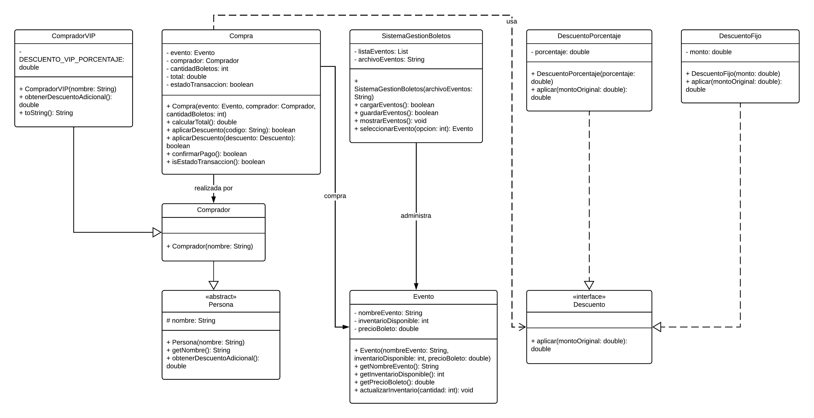

# Sistema de Gestión de Venta de Boletos para Eventos

## Integrantes

- José Edgardo Rosales Escamilla [00129426]
- Xiomara Molina Amaya [00253220]
- Daniel Eduardo García Hernández [00220826]

## Descripción

Desarrollo de clases e implementación de patrones de diseño para estructurar y
gestionar el sistema de compra de boletos para eventos, promoviendo una
arquitectura modular y robusta que mejora la organización del sistema,
facilita su mantenimiento y optimiza la integración entre la lógica de
negocio, la interfaz gráfica y la persistencia de datos.

## Tercer entregable

Actualización de diagramas de clases y desarrollo en Java, integrando
**clases abstractas** e **interfaces** (contratos) al diseño:

- `Persona` se convierte en **clase abstracta**: modela el concepto común a
  `Comprador` y `CompradorVIP`, pero no puede instanciarse por sí sola.
- `Descuento` se convierte en **interfaz**: define el contrato
  `aplicar(double)` que implementan `DescuentoPorcentaje` y `DescuentoFijo`.
- `Compra` depende del contrato `Descuento`, no de una implementación
  concreta, aplicando polimorfismo.

## Diagrama de clases



## Estructura del proyecto
```
Proyecto_Gestion_Boletos_POO/
├── build.gradle
├── settings.gradle
├── eventos.txt              (no incluido en el repo, ver abajo)
├── docs/
│   └── diagrama-clases.jpg
└── src/
    └── main/
        └── java/
            ├── Main.java
            └── model/
                ├── Evento.java
                ├── Persona.java                 (clase abstracta)
                ├── Comprador.java
                ├── CompradorVIP.java
                ├── Compra.java
                ├── Descuento.java               (interfaz)
                ├── DescuentoPorcentaje.java     (implements Descuento)
                ├── DescuentoFijo.java           (implements Descuento)
                └── SistemaGestionBoletos.java
```

## Funcionalidad principal

- Carga y guarda el listado de eventos en un archivo de texto.
- Permite seleccionar un evento y comprar boletos, validando stock disponible.
- Soporta comprador **VIP** (`CompradorVIP`), que recibe automáticamente un
  10% de descuento adicional sobre el total.
- Soporta códigos de descuento manuales: `DESC10` (10%) y `DESC5` (5%).

## Archivo `eventos.txt`

El sistema busca un archivo `eventos.txt` en la raíz del proyecto (mismo nivel
donde se ejecuta el programa). Cada línea representa un evento con el formato:

```
nombre|inventario|precio
```

Ejemplo:
```
Concierto Rock|100|25.5
Obra de Teatro|5|10.0
```

## Metodología de trabajo

Este proyecto se desarrolla siguiendo **Gitflow** como metodología de trabajo
colaborativo (ramas `main`, `develop`, `feature/*`).

## Cómo ejecutar

**Desde IntelliJ IDEA:** abrir el proyecto y ejecutar la clase `Main.java`.

**Desde la terminal:**
```bash
javac -d out src/main/java/Main.java src/main/java/model/*.java
cp eventos.txt out/
cd out
java Main
```