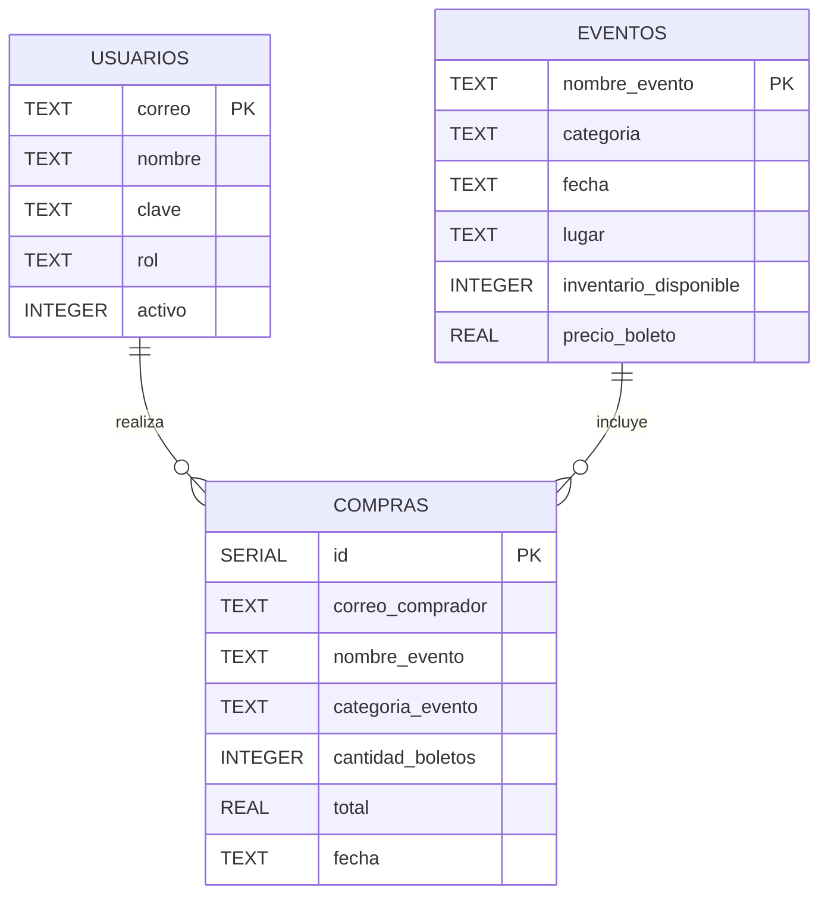

# Diagrama entidad-relación

Este documento describe el esquema de la base de datos PostgreSQL del
sistema tal como está en `main` y `develop` al momento de escribirlo.
El esquema se crea desde `persistencia.ConexionBD.crearTablas()` con
sentencias `CREATE TABLE IF NOT EXISTS` que corren en la primera
conexión.

## Diagrama

> Las relaciones dibujadas son las lógicas del dominio. Actualmente
> `compras.correo_comprador` y `compras.nombre_evento` viajan como
> `TEXT` sin restricción de foreign key a nivel de motor. La
> integridad se aplica desde el código Java. La imposición de FKs a
> nivel de BD queda pendiente hasta que se mergee el PR #62 (Flyway).

## Tablas

### `usuarios`

Guarda los usuarios registrados en el sistema, tanto administradores
como clientes.

| Columna  | Tipo    | Restricciones      |
|----------|---------|--------------------|
| correo   | TEXT    | PRIMARY KEY        |
| nombre   | TEXT    | NOT NULL           |
| clave    | TEXT    | NOT NULL           |
| rol      | TEXT    | NOT NULL           |
| activo   | INTEGER | NOT NULL, 0 o 1    |

- `rol` toma los valores del enum `catalogo.RolUsuario`: `ADMINISTRADOR`
  o `CLIENTE`.
- `activo` se guarda como entero (0/1) por compatibilidad con motores
  que no traen tipo booleano nativo.
- `clave` actualmente se guarda en texto plano. Hashear con BCrypt
  está anotado en el issue #58 como backlog.

### `eventos`

Cada evento se identifica por su nombre único.

| Columna                 | Tipo    | Restricciones      |
|-------------------------|---------|--------------------|
| nombre_evento           | TEXT    | PRIMARY KEY        |
| categoria               | TEXT    | NOT NULL           |
| fecha                   | TEXT    | NOT NULL, ISO-8601 |
| lugar                   | TEXT    | NOT NULL           |
| inventario_disponible   | INTEGER | NOT NULL           |
| precio_boleto           | REAL    | NOT NULL           |

- `categoria` guarda el valor "de BD" del enum `catalogo.Categoria`
  (sin tildes): `Musica`, `Teatro`.
- `fecha` se guarda como texto ISO-8601 (`yyyy-MM-dd`) para portabilidad.

### `compras`

Historial de compras registradas. Cada fila representa una compra
confirmada.

| Columna            | Tipo    | Restricciones                              |
|--------------------|---------|--------------------------------------------|
| id                 | SERIAL  | PRIMARY KEY                                |
| correo_comprador   | TEXT    | NOT NULL                                   |
| nombre_evento      | TEXT    | NOT NULL                                   |
| categoria_evento   | TEXT    | NOT NULL                                   |
| cantidad_boletos   | INTEGER | NOT NULL                                   |
| total              | REAL    | NOT NULL                                   |
| fecha              | TEXT    | NOT NULL, ISO-8601                         |

- `categoria_evento` se duplica desde `eventos` para acelerar el
  reporte por categoría (HU-09) y para conservar la categoría original
  incluso si el evento cambia de categoría después.

## Cambios pendientes en el esquema

Estos cambios están abiertos como PRs pero aún no se han mergeado a
`develop`. Este documento se actualizará cuando entren:

- **#62 (Flyway + FKs + índices)**: migrará el esquema a
  `src/main/resources/db/migration/` con archivos versionados,
  agregará foreign keys en `compras` hacia `usuarios(correo)` y
  `eventos(nombre_evento)` (ambas con `ON UPDATE CASCADE`,
  `ON DELETE RESTRICT`) y creará índices en
  `compras(categoria_evento)`, `compras(correo_comprador)`,
  `compras(fecha)` y `eventos(categoria)`.
- **#64 (SLF4J + auditoría)**: agregará la tabla `auditoria` con
  columnas `id`, `fecha_hora`, `actor`, `accion`, `entidad`,
  `referencia` y `detalle` para registrar acciones sensibles desde
  el Panel de Administración.
