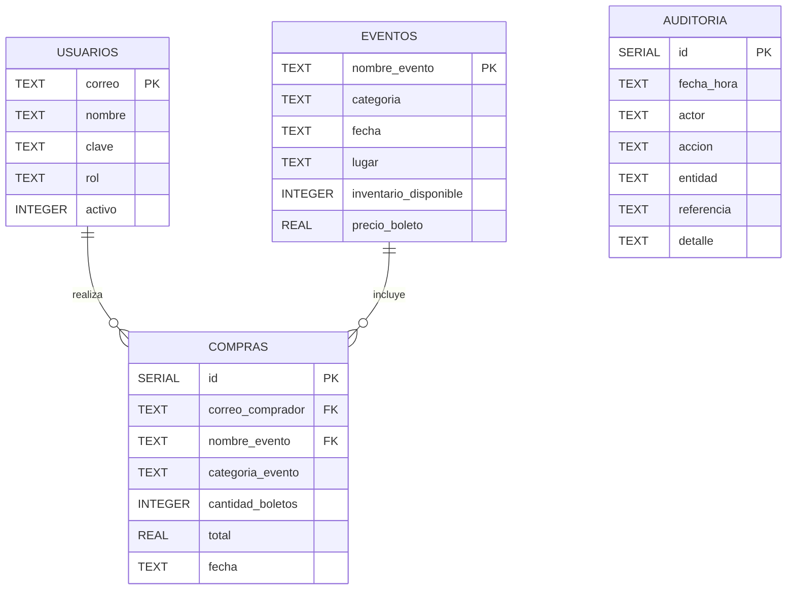

# Diagrama entidad-relación

Este documento describe el esquema de la base de datos PostgreSQL del
sistema. El esquema vive en migraciones Flyway bajo
`src/main/resources/db/migration/` y se actualiza en cada release.

## Diagrama

## Tablas

### `usuarios`

Guarda los usuarios registrados en el sistema, tanto administradores
como clientes.

| Columna  | Tipo             | Restricciones      |
|----------|------------------|--------------------|
| correo   | TEXT             | PRIMARY KEY        |
| nombre   | TEXT             | NOT NULL           |
| clave    | TEXT             | NOT NULL           |
| rol      | TEXT             | NOT NULL           |
| activo   | INTEGER          | NOT NULL, 0 o 1    |

- `rol` toma los valores del enum `catalogo.RolUsuario`: `ADMINISTRADOR`
  o `CLIENTE`.
- `activo` se guarda como entero (0/1) por compatibilidad con motores
  que no traen tipo booleano nativo.

### `eventos`

Cada evento se identifica por su nombre único.

| Columna                 | Tipo    | Restricciones      |
|-------------------------|---------|--------------------|
| nombre_evento           | TEXT    | PRIMARY KEY        |
| categoria               | TEXT    | NOT NULL           |
| fecha                   | TEXT    | NOT NULL, ISO-8601 |
| lugar                   | TEXT    | NOT NULL           |
| inventario_disponible   | INTEGER | NOT NULL           |
| precio_boleto           | REAL    | NOT NULL           |

- `categoria` guarda el valor "de BD" del enum `catalogo.Categoria`
  (sin tildes): `Musica`, `Teatro`, etc.
- `fecha` se guarda como texto ISO-8601 (`yyyy-MM-dd`) para portabilidad.

### `compras`

Historial de compras registradas. Cada fila representa una compra
confirmada.

| Columna            | Tipo    | Restricciones                              |
|--------------------|---------|--------------------------------------------|
| id                 | SERIAL  | PRIMARY KEY                                |
| correo_comprador   | TEXT    | NOT NULL, FK → `usuarios(correo)`          |
| nombre_evento      | TEXT    | NOT NULL, FK → `eventos(nombre_evento)`    |
| categoria_evento   | TEXT    | NOT NULL                                   |
| cantidad_boletos   | INTEGER | NOT NULL                                   |
| total              | REAL    | NOT NULL                                   |
| fecha              | TEXT    | NOT NULL, ISO-8601                         |

- Ambas foreign keys usan `ON UPDATE CASCADE` y `ON DELETE RESTRICT`
  para preservar la integridad histórica.
- `categoria_evento` se duplica desde `eventos` para acelerar el
  reporte por categoría (HU-09) y para conservar la categoría original
  incluso si el evento cambia de categoría después.

### `auditoria`

Registra las acciones sensibles ejecutadas desde el Panel de
Administración. Es una tabla de apéndice: no se actualiza ni se elimina.

| Columna     | Tipo    | Restricciones      |
|-------------|---------|--------------------|
| id          | SERIAL  | PRIMARY KEY        |
| fecha_hora  | TEXT    | NOT NULL, ISO-8601 |
| actor       | TEXT    | NOT NULL           |
| accion      | TEXT    | NOT NULL           |
| entidad     | TEXT    | NOT NULL           |
| referencia  | TEXT    |                    |
| detalle     | TEXT    |                    |

## Índices

Además de los índices implícitos por las llaves primarias, existen los
siguientes índices explícitos para acelerar las consultas más comunes:

- `idx_compras_categoria` sobre `compras(categoria_evento)` — usado por
  el reporte por categoría (HU-09).
- `idx_compras_correo` sobre `compras(correo_comprador)` — usado por el
  historial del cliente (HU-06).
- `idx_compras_fecha` sobre `compras(fecha)` — usado por el filtro por
  fechas del historial (HU-06).
- `idx_eventos_categoria` sobre `eventos(categoria)` — usado por los
  listados filtrados del Panel de Administración.
