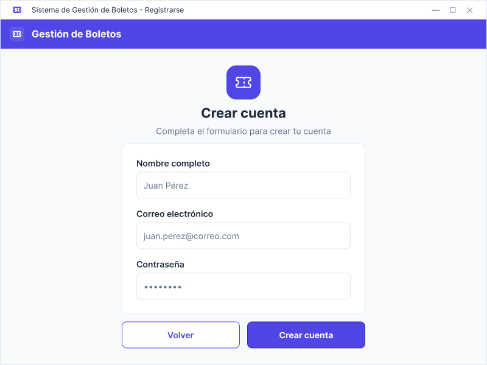
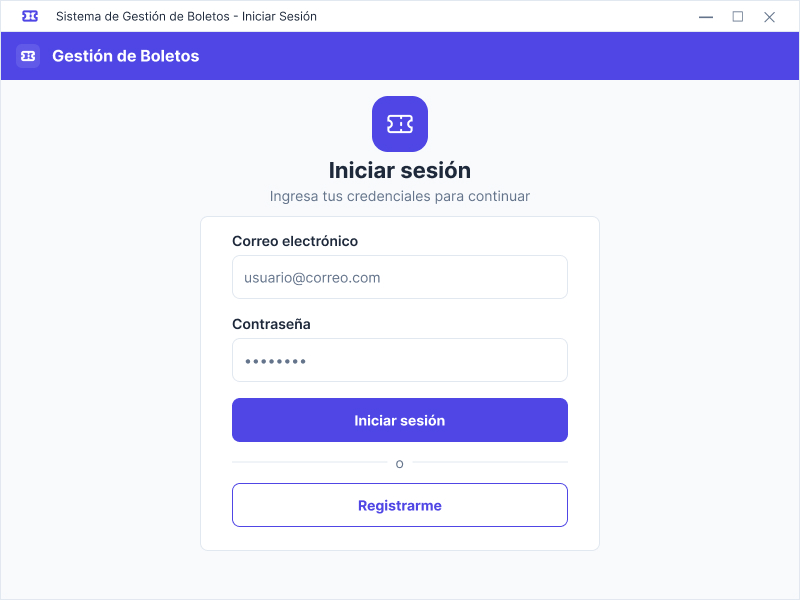
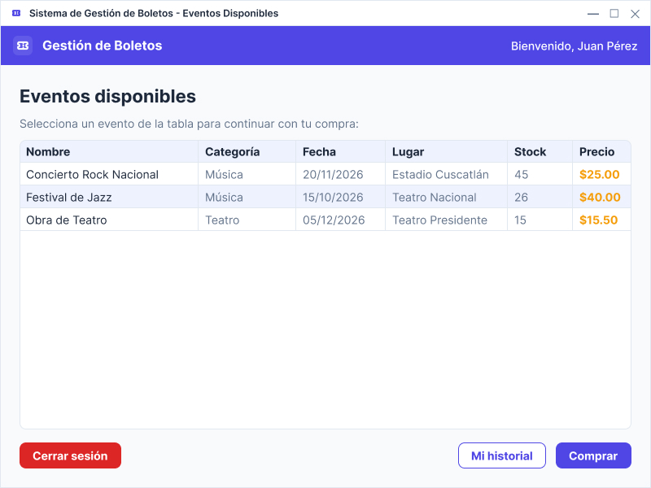
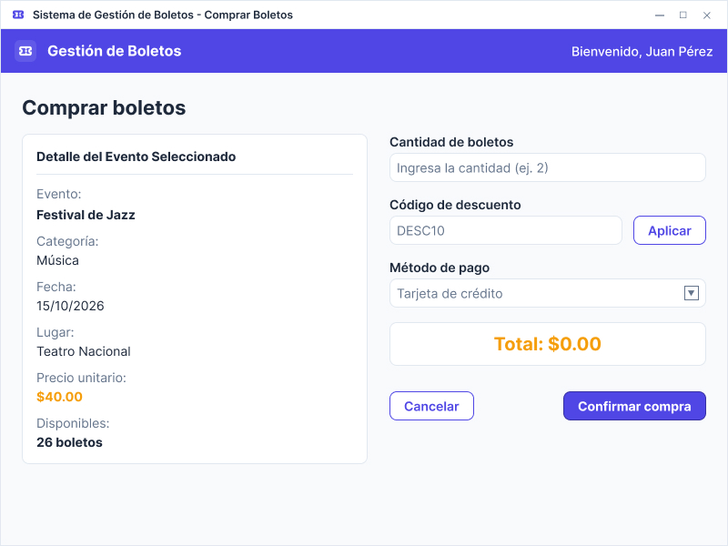
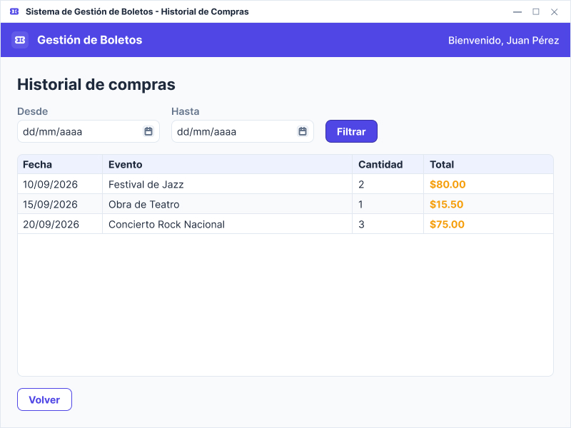
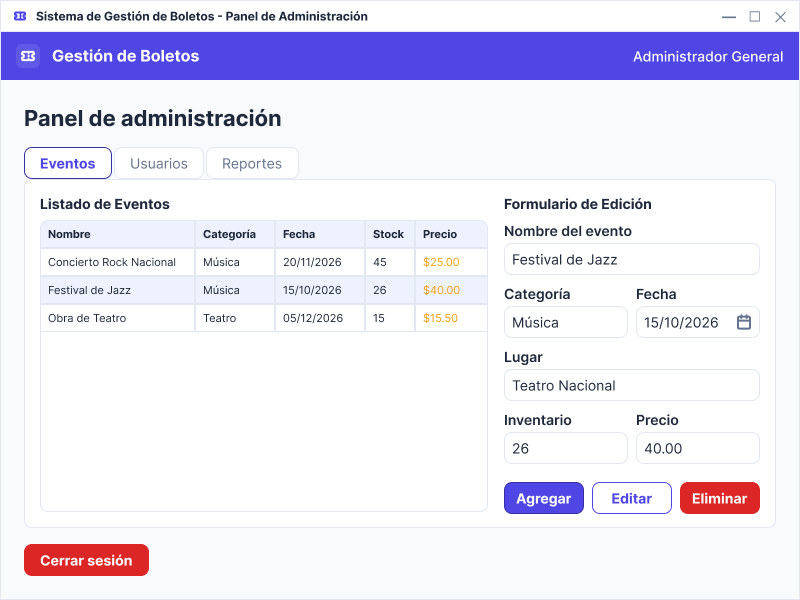
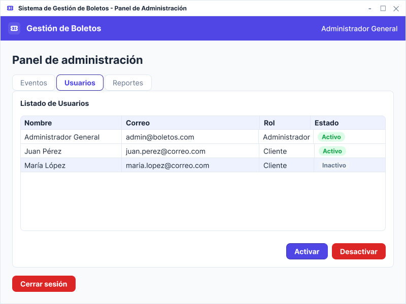
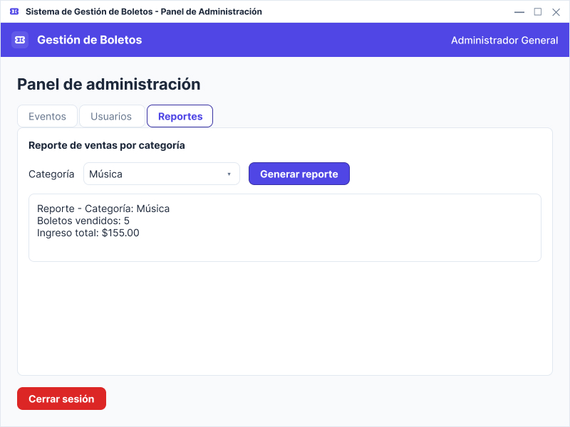

# Manual de usuario

Guía paso a paso de cómo usar la aplicación desde la interfaz gráfica.
Está dividida en dos secciones: **Cliente** (comprador de boletos) y
**Administrador**.

Los wireframes referenciados en cada paso viven en
[`wireframes/`](../wireframes) y se corresponden con las pantallas
reales de la aplicación.

## Requisitos para el usuario

- Tener la aplicación corriendo. Ver
  [`README.md`](../README.md#cómo-ejecutar) para el paso de
  instalación.
- Tener conexión a la base de datos (Docker Desktop encendido con
  el contenedor de Postgres arriba).

## Sección 1 — Cliente

### 1.1 Registro

1. Desde la pantalla de inicio de sesión, presionar **Registrarme**.
2. Llenar el formulario con nombre completo, correo electrónico
   (será el identificador de la cuenta) y una contraseña.
3. Presionar **Crear cuenta**.
4. Si el correo ya existe, la aplicación muestra una advertencia y
   pide otro correo. Si el registro es exitoso, se vuelve a la
   pantalla de inicio de sesión.

### 1.2 Inicio de sesión

1. Ingresar correo y contraseña en la pantalla de login.
2. Presionar **Iniciar sesión**.
3. Si las credenciales son correctas y la cuenta está activa, la
   aplicación abre la pantalla de eventos disponibles.
4. Si la cuenta está desactivada o las credenciales son
   incorrectas, aparece una alerta con el mensaje correspondiente.

### 1.3 Ver eventos disponibles

1. La tabla muestra todos los eventos vigentes con nombre,
   categoría, fecha, lugar, stock disponible y precio del boleto.
2. Los eventos se pueden filtrar por categoría desde el
   combo superior.
3. Al seleccionar un evento y presionar **Comprar**, la aplicación
   navega a la pantalla de compra.

### 1.4 Comprar boletos

1. La pantalla muestra el detalle del evento: nombre, categoría,
   fecha, lugar, precio unitario y stock disponible.
2. Ingresar la cantidad de boletos deseada. El total se actualiza
   automáticamente.
3. (Opcional) Ingresar un código de descuento (`DESC10` para 10%,
   `DESC5` para 5%) y presionar **Aplicar código**.
4. Seleccionar un método de pago del combo.
5. Presionar **Confirmar compra**. Si todo está en orden, aparece
   un mensaje de éxito y se descuenta el inventario del evento.

### 1.5 Historial de compras

1. Desde la pantalla de eventos, presionar **Historial**.
2. La tabla muestra todas las compras del usuario, con fecha,
   evento, cantidad y total.
3. Se puede filtrar por rango de fechas con los dos `DatePicker`
   superiores y presionar **Filtrar**.
4. Presionar **Regresar** vuelve a la pantalla de eventos.

## Sección 2 — Administrador

Usuario de prueba: **`admin@boletos.com`** / **`admin123`**.

Después de iniciar sesión con una cuenta con rol `ADMINISTRADOR`, la
aplicación abre el **Panel de Administración** con tres pestañas.

### 2.1 Pestaña Eventos (HU-07)

**Listado de eventos**: la tabla de la izquierda muestra todos los
eventos registrados con su nombre, categoría, fecha, stock y precio.

**Agregar un evento nuevo**:

1. En el formulario de la derecha, llenar los campos: nombre,
   categoría, fecha, lugar, inventario inicial y precio del boleto.
2. Presionar **Agregar**.
3. Si el nombre ya existe, aparece una advertencia. Si no, el
   evento se guarda y aparece en la tabla al instante.

**Editar un evento existente**:

1. Seleccionar el evento en la tabla. El formulario se llena con
   sus datos actuales.
2. Cambiar los campos que se quieran modificar. El nombre del
   evento **no** se puede cambiar (es la llave primaria).
3. Presionar **Editar**.
4. Aparece confirmación y la fila se actualiza con los nuevos
   datos.

**Eliminar un evento**:

1. Seleccionar el evento en la tabla.
2. Presionar **Eliminar**.
3. Aparece un diálogo de confirmación. Aceptar lo elimina de la
   base y de la tabla.

### 2.2 Pestaña Usuarios (HU-08)

La tabla muestra todos los usuarios registrados con nombre, correo,
rol y estado (Activo / Inactivo).

**Activar o desactivar un usuario**:

1. Seleccionar la fila del usuario.
2. Presionar **Activar** o **Desactivar** según el caso.
3. Si el usuario ya está en el estado que se pidió, aparece una
   advertencia y no se hace nada.
4. Si el cambio es válido, se actualiza el estado del usuario en la
   base y en la tabla.

Un usuario `Inactivo` no puede iniciar sesión — la validación se
hace en la pantalla de login.

### 2.3 Pestaña Reportes (HU-09)

1. Seleccionar la categoría del reporte en el combo (`Música` o
   `Teatro`).
2. Presionar **Generar reporte**.
3. Mientras se consulta la base, el área de resultado muestra
   `Generando reporte...`.
4. Al terminar, aparece un reporte con la categoría, el total de
   boletos vendidos y el ingreso total.
5. Si no hay compras registradas para la categoría, aparece el
   mensaje `No hay datos disponibles para la categoria 'X'`.

### 2.4 Cerrar sesión

En cualquier pestaña, el botón **Cerrar sesión** en la esquina
inferior izquierda pide confirmación y vuelve a la pantalla de
login.

## Alertas comunes

- **"Completa todos los campos del formulario."** — algún campo del
  formulario de evento quedó vacío.
- **"La fecha del evento no puede ser pasada."** — al agregar un
  evento con fecha anterior a hoy.
- **"El inventario no puede ser negativo."** — se ingresó un valor
  menor a cero en el inventario.
- **"El precio debe ser mayor a cero."** — se ingresó un precio
  menor o igual a cero.
- **"No se pudieron cargar los datos. Verifica que Docker esté en
  ejecución."** — el contenedor de Postgres no está corriendo.
